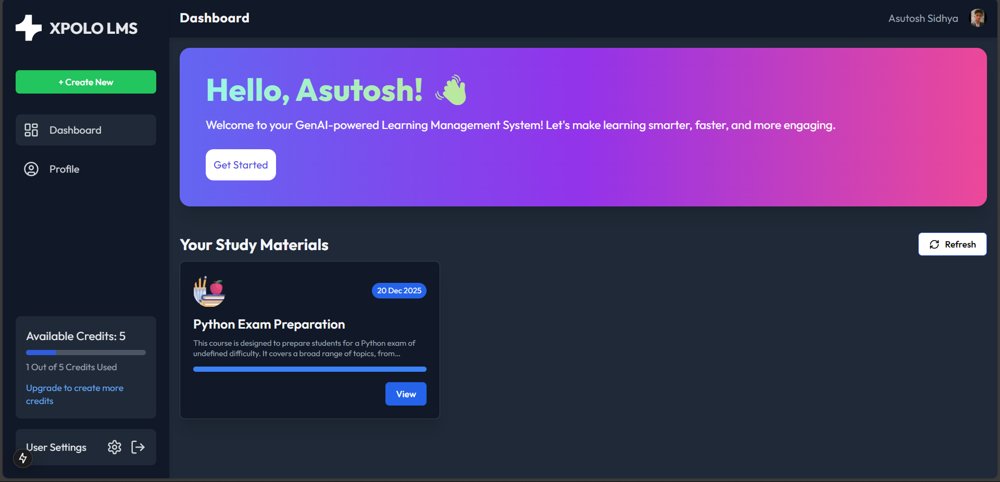
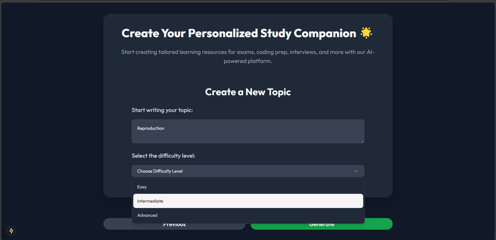
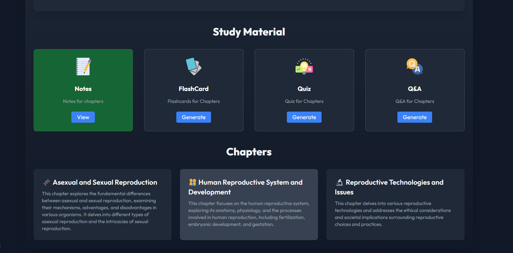
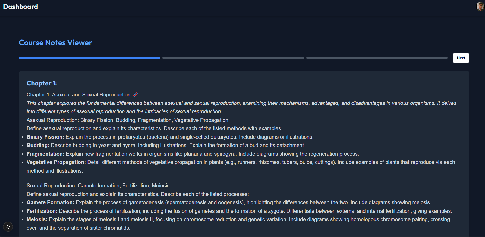
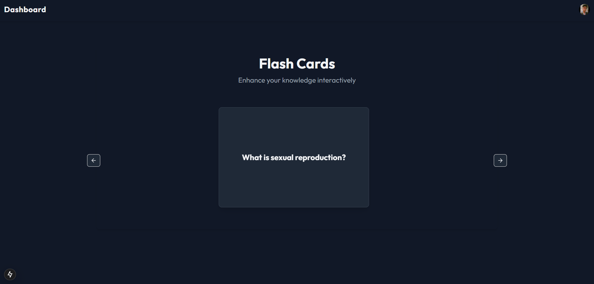
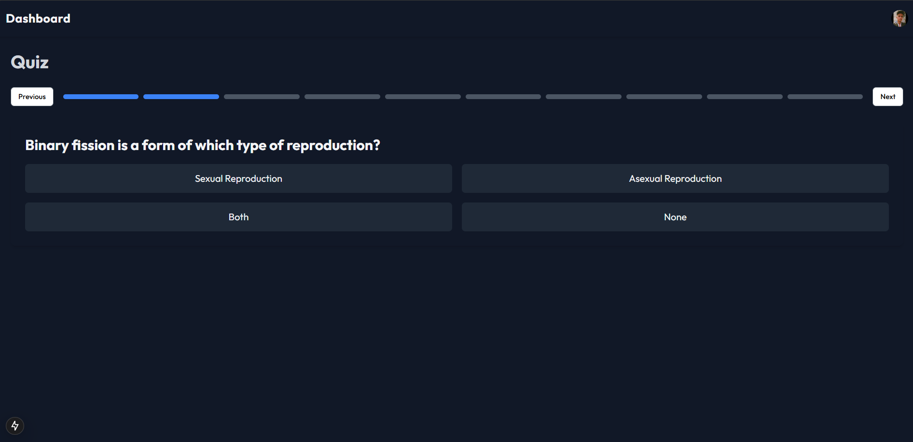
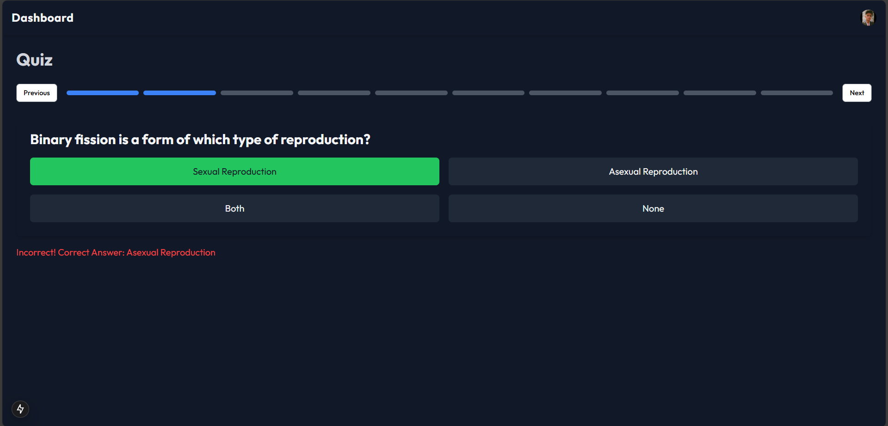
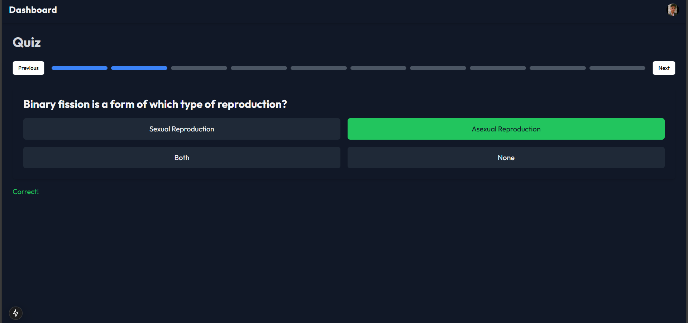
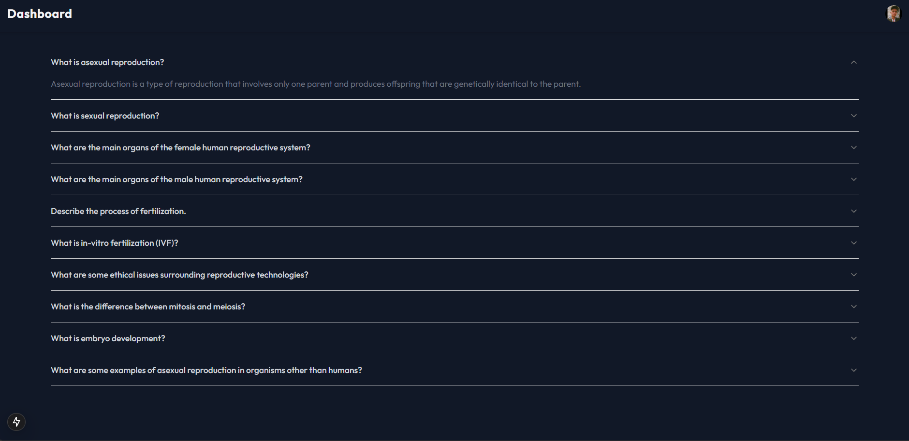

Sure! Here’s an updated and visually enhanced version of your `README.md` with more polished formatting, improved visual flow, and more attractive typography:

# 🌐 **Comprehensive Modern Web Application Stack**

Delivering a **seamless development** and **user experience** with cutting-edge technologies.

---


### 📊 **Dashboard Overview**


### 📝 **Create First Step**


### 📝 **Create Second Step**


### 📚 **Study Materials**


### 🗒️ **Notes View**


### 🎴 **FlashCard View**


### ❓ **Quiz View**


### 🚫 **Wrong Option Selection**


### ✅ **Right Option Selection**


### 💬 **Question and Answers**


### 🔑 **Final Dashboard**


---

## 🚀 **Key Features**

- 🌟 **Inngest**: Simplified event-driven workflows for serverless functions.
- 🐘 **NeonDB**: Efficient and scalable serverless PostgreSQL database.
- 💳 **Stripe API**: Integrated payment gateway for secure transactions.
- ⚛️ **Next.js**: React framework for building fast, scalable web applications.
- 🎨 **Tailwind CSS**: Utility-first CSS framework for rapid UI development.
- 🧩 **Shadcn/UI**: Prebuilt components to accelerate your design process.
- 🔐 **Clerk Auth**: Authentication made simple with Clerk's user management solution.
- 🤖 **Gemini AI**: AI-powered features to enhance your application.
- 🗃️ **Drizzle ORM**: Type-safe and intuitive ORM for database interactions.

---

## 🛠️ **Getting Started**

### **Prerequisites**

Before you begin, ensure you have the following installed:

- 🖥️ [Node.js](https://nodejs.org/) (LTS version recommended)
- 📦 [npm](https://www.npmjs.com/) or [yarn](https://yarnpkg.com/)
- 🗄️ A PostgreSQL instance on **NeonDB**

---

### **Installation Steps**

1. **Clone the Repository**:
   ```bash
   git clone https://github.com/sidhyaashu/gen-lms.git
   cd gen-lms
   ```

2. **Install Dependencies**:
   ```bash
   npm install
   # or
   yarn install
   ```

3. **Configure Environment Variables**:
   Create a `.env` file in the root directory and add the following configuration:
   ```env
   DATABASE_URL=your_database_url
   GEMINI_API_KEY=your_gemini_api_key

   NEXT_PUBLIC_CLERK_PUBLISHABLE_KEY=your_clerk_publishable_key
   CLERK_SECRET_KEY=your_clerk_secret_key

   NEXT_PUBLIC_CLERK_SIGN_IN_URL=/sign-in
   NEXT_PUBLIC_CLERK_SIGN_UP_URL=/sign-up
   ```

4. **Run the Application**:
   ```bash
   npm run dev
   # or
   yarn dev
   ```
   Visit [http://localhost:3000](http://localhost:3000) in your browser to access the application.

---

## 🔄 **Database Management with Drizzle Kit**

Efficiently manage your database with **Drizzle Kit**:

- **Push Migrations**:
  ```bash
  npx drizzle-kit generate
  npx drizzle-kit push
  ```

- **Open Drizzle Studio**:
  ```bash
  npx drizzle-kit studio
  ```

- **Run Inngest CLI**:
  ```bash
  npx inngest-cli@latest dev
  npx inngest-cli@latest dev --no-discovery -u http://localhost:3000/api/inngest
  ```

---

## 📂 **Project Structure**

Here’s an overview of the project structure:

```plaintext
├── public
├── src
│   ├── components      # Reusable components
│   ├── pages           # Application pages
│   ├── styles          # Tailwind and custom styles
│   ├── utils           # Utility functions
│   └── hooks           # Custom React hooks
├── .env                # Environment variables
├── drizzle.config.ts   # Drizzle ORM configuration
├── tailwind.config.js  # Tailwind CSS configuration
├── next.config.js      # Next.js configuration
└── README.md           # Project documentation
```

---

## 🤝 **Contributing**

We welcome contributions! Follow these steps to get started:

1. 🍴 Fork the repository.
2. 🌿 Create a new branch:
   ```bash
   git checkout -b feature/your-feature-name
   ```
3. 💾 Commit your changes:
   ```bash
   git commit -m "Add some feature"
   ```
4. 🔄 Push to the branch:
   ```bash
   git push origin feature/your-feature-name
   ```
5. 📝 Open a Pull Request.

---

## 🌟 **Acknowledgments**

A special thanks to these awesome tools and platforms that helped bring this project to life:

- 🌟 [Inngest](https://www.inngest.com/) - Event-driven serverless functions
- 🐘 [NeonDB](https://neon.tech/) - Scalable serverless PostgreSQL
- 💳 [Stripe](https://stripe.com/) - Secure payment gateway
- ⚛️ [Next.js](https://nextjs.org/) - React framework for modern web apps
- 🎨 [Tailwind CSS](https://tailwindcss.com/) - Utility-first CSS framework
- 🧩 [Shadcn/UI](https://ui.shadcn.dev/) - Prebuilt UI components
- 🔐 [Clerk Auth](https://clerk.dev/) - Authentication and user management
- 🤖 [Gemini AI](https://gemini.ai/) - AI-powered features
- 🗃️ [Drizzle ORM](https://orm.drizzle.team/) - Type-safe ORM for database queries

---

### 💻 **Built with ❤️ by [Asutosh Sidhya](https://github.com/sidhyaashu)**


This version should provide a clean and engaging user experience for readers and developers alike!